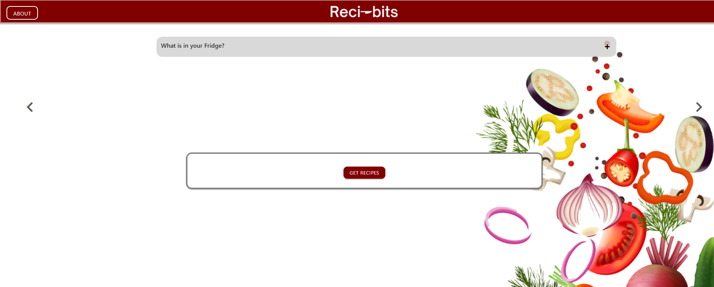
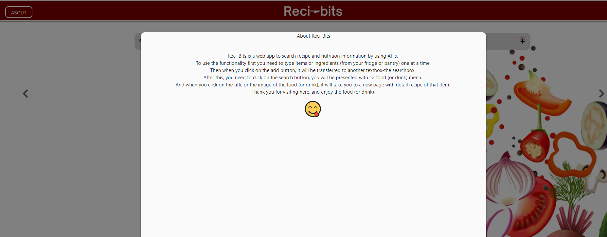
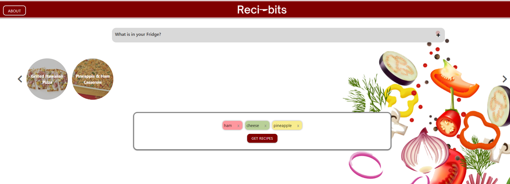
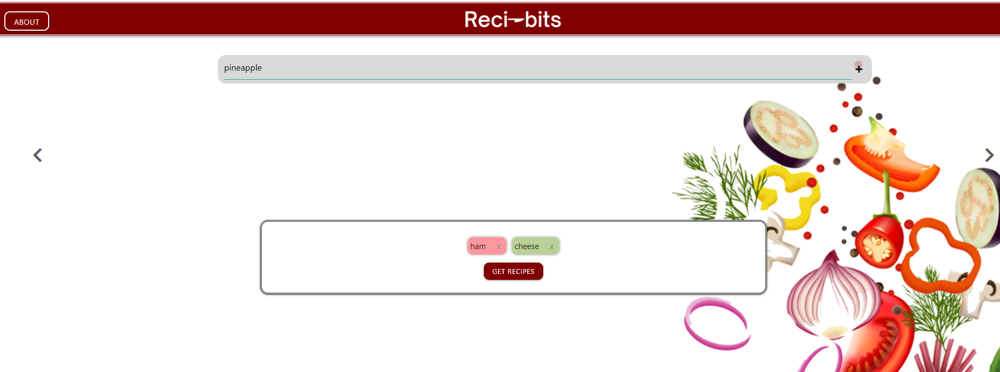
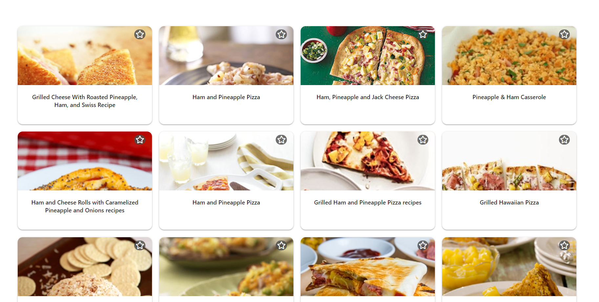
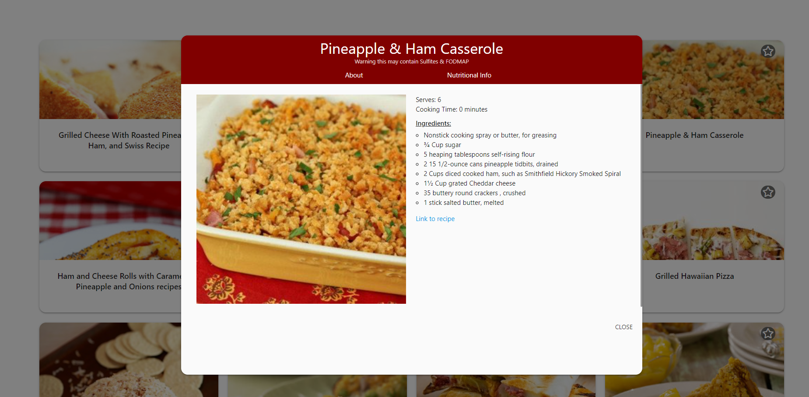
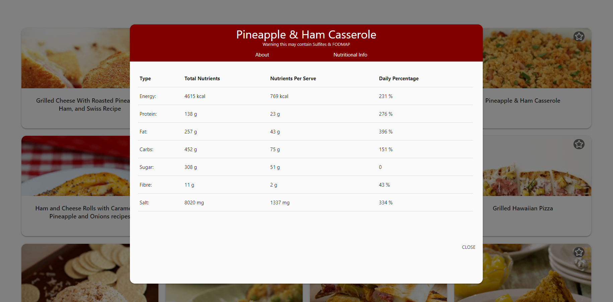

# Reci-bits
This is a web app to search for recipe and nutrition information from ingredient or food (or drink) items provided.Basically the Idea was conceived from the day to day scenario of opening the fridge and seeing some items there but not having the knowledge what to make from those items.
The localStorage is also used for storing the searched recipe (favorite one) data locally and it will be loaded when the page is loaded.

This has been deployed to GitHub. To get this web app ( or project) up and running, one can follow the link(deployment).one can also download the file to use as template.
 
* [GitHub Repository](https://github.com/willygodwin/reci-bits/): https://github.com/willygodwin/reci-bits/
* [Deployed GitHub IO](https://willygodwin.github.io/reci-bits/index.html): https://willygodwin.github.io/reci-bits/index.html

The screenshot of Reci-bits :

### project's Summary
Reci-Bits is a web app to search recipe and nutrition information by using two APIs.
To use the functionality first you need to type items or ingredients (from your fridge or pantry) one at a time
Then when you click on the add button, it will be transferred to another textbox-the searchbox.
After this, you need to click on the search button, you will be presented with 12 food (or drink) menu.
And when you click on the title or the image of the food (or drink), it will take you to a new page with detail recipe and nutritional information of that item.

* The user will be presented with a input box (aka textbox) and when at least one ingredient is entered and click on the + button

then this item will be added to the get recipe area (box) of the page 

When the user click on the about button on top of the page, it will show the user a page describing the app and how to use it

### The Details: 

* When the user opens the page, the “displaySavedRecipe” function is fired up which will fetch the stored recipes from the local storage and  display them

* When the ingredient is typed in the ingredient box and clicked on + button, the ingredient will pass to the search area (get recipe area)

* After this when "Get Recipe" button is clicked, ajax call to the server(edamam.com) is made with API to get the recipe info by firing the searchRecipes function

* And when the user clicks on the displayed item (means the image with the title of the recipe), details about that item will be displayed by calling the "populateAbout" function.

* And when the user clicks on the "Nutritional Info" tab, nutritional information about that item will be displayed by the use of "populateNuteInfo" function.

### How To Execute the Files:
> The files should be Open in browser.

### Features: 
* HTML Page
    * Index.html 
        The main UI design
* CSS file
    * getrecipe.css
    * styles.css
         for the style of the page (index.html)
* Javascript file
         getrecipe.js for all the functions of the page to display recipes and nutritional informations

## Authors

* **Naresh Raj Poudel** - [Git Hub Profile](https://github.com/citenaresh): https://github.com/citenaresh

* **William Godwin** - [Git Hub Profile](https://github.com/willygodwin): https://github.com/willygodwin

* **Vincent Sumargo** - [Git Hub Profile](https://github.com/vsumargo): https://github.com/vsumargo

* **Kris Alido** - [Git Hub Profile](https://github.com/kwis07): https://github.com/kwis07

## Acknowledgments

* Great gratitude to Luca ([https://github.com/duvet86](https://github.com/duvet86)), Sam ([https://github.com/sam-ngu](https://github.com/sam-ngu)) and Renata from the UWA Bootcamp for their enormous help.
